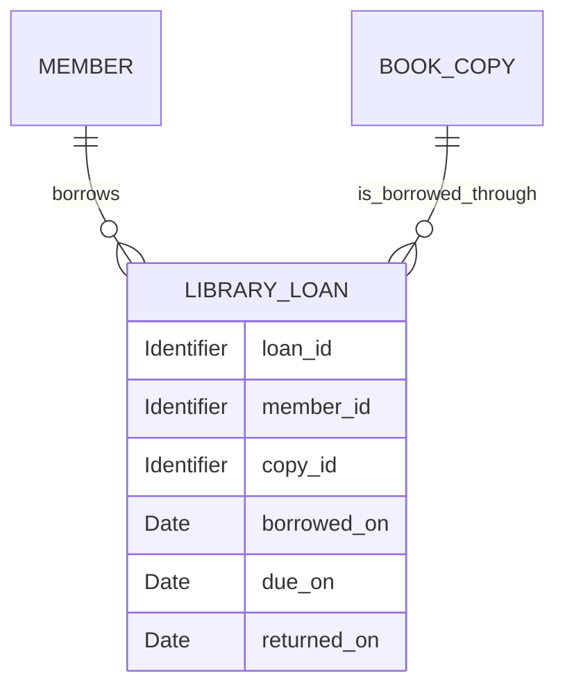

# Conceptual Database Model Guide

## Purpose

A conceptual database model explains how facts from one corresponding business entity specification can be represented as persistent information. It is normative for conceptual objects, identity, attributes, relationships, and integrity, but neutral about database products and physical schemas.

The business entity specification remains authoritative. Surface a missing or contradictory business fact instead of resolving it silently.

## Required Evidence

Do not call the model complete until the following are known:

- primary business entity specification and modeled scope;
- conceptual data objects and the business meaning of each;
- stable identifiers and their uniqueness scope;
- attributes, conceptual types, and required, optional, conditional, or derived status;
- relationships, minimum and maximum cardinality, ownership, and dependency;
- identity, uniqueness, reference, temporal, and cross-attribute constraints;
- derived values and the persisted source facts used to obtain them;
- diagram, traceability matrix, and one coherent representative example.

Optional information includes authoritative data source, confidentiality, retention, audit, jurisdiction, volume, growth, and confirmed assumptions.

## Derivation Rules

- Preserve canonical business names and definitions.
- Trace every object, identifier, attribute, relationship, and constraint to a source fact or confirmed user decision.
- Distinguish a business identifier from a conceptual reference identifier.
- Distinguish persisted facts from values calculated from those facts.
- Reference related entities without redefining them unless their specifications are also in scope.
- Do not introduce a status field or status derivation that merely summarizes other facts.
- Do not weaken an invariant for implementation convenience.

## Exclusions

Exclude SQL and vendor types, DDL, migrations, indexes, partitions, query plans, replication, backup configuration, ORM annotations, programming-language types, API schemas, UI state, and performance-driven denormalization. A conceptual object may later become a table, but this document does not make that physical decision.

## Document Template

```markdown
# Conceptual Database Model: <Business Entity>

## Scope and Source

## Conceptual Data Objects

## Identifiers

## Attribute Dictionary

## Relationships and Cardinality

## Integrity Constraints

## Derived Information

## Conceptual Diagram

## Traceability Matrix

## Representative Data Example

## Confirmed Assumptions and Open Questions
```

Use tables for object, identifier, attribute, relationship, and traceability dictionaries. State conceptual types such as Identifier, Text, Date, Timestamp, Boolean, Decimal, and Enumeration rather than storage types.

The diagram must be a Mermaid ER diagram or a fenced text diagram. Explain any relationship whose meaning or cardinality is not self-evident.

## Quality Checks

- The named business entity specification is the primary source.
- Stable identity is separate from mutable display information.
- Cardinality and optionality agree with business relationships.
- Every persistence-relevant invariant has a matching conceptual constraint.
- Diagram, dictionaries, constraints, traceability, and example describe one model.
- Unknown facts are explicit, and physical design is absent.

## Universal Example

A Library Loan model may contain Member and Book Copy references plus the Library Loan object.



`loan_id` uniquely identifies a loan. Each loan references exactly one member and one copy. `due_on` must be later than `borrowed_on`; `returned_on`, when present, cannot precede `borrowed_on`; and a copy can have at most one loan without a return date.

Example data: loan `L-1042` links member `M-18` to copy `B-204`, borrowed July 1, due July 15, with no return date. Another loan without a return date cannot reference `B-204`.
