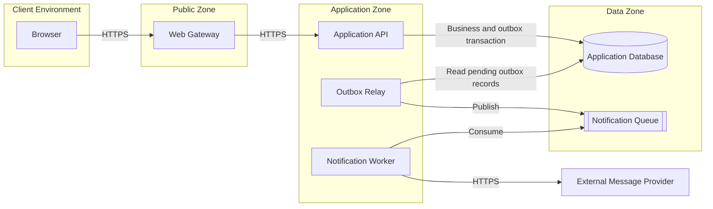

# Distributed Architecture Guide

## Contents

- [Purpose](#purpose)
- [Required Evidence](#required-evidence)
- [Modeling Rules](#modeling-rules)
- [Diagram and Text Contract](#diagram-and-text-contract)
- [Exclusions](#exclusions)
- [Document Template](#document-template)
- [Quality Checks](#quality-checks)
- [Universal Example](#universal-example)

## Purpose

A distributed architecture specification describes collaborating system components, their deployment, state ownership, and explicit communication paths. It combines three views:

- component view: responsibilities and boundaries;
- deployment view: deployable units, runtime nodes, placement, and scaling;
- connection view: direction, purpose, interaction style, protocol, and trust boundary.

Name a technology or hosting product only when it is a confirmed constraint. Otherwise use capability terms such as relational database, message broker, container, or managed service.

## Required Evidence

Do not call the architecture complete until the following are known:

- scope, excluded systems, business goals, and quality drivers;
- actors and external systems outside the system boundary;
- logical components, responsibilities, exposed and consumed interfaces, and owned state;
- deployment units, runtime form, placement, replicas or scaling model, and isolation constraints;
- every connection's source, destination, direction, purpose, style, protocol, and material security or reliability behavior;
- data ownership, allowed writers, transactional boundaries, and consistency model;
- primary request, query, and event flows;
- critical dependencies, degraded behavior, retry boundaries, recovery, and failure domains;
- trust zones, sensitive flows, least-privilege expectations, and operational ownership;
- diagram, connection matrix, decisions, assumptions, and open risks.

## Modeling Rules

- Keep a logical component distinct from the process or artifact that deploys it and the node on which it runs.
- Give every component one coherent responsibility and every stateful resource an ownership rule.
- Show synchronous and asynchronous connections differently.
- Name the purpose of every connection; do not draw unexplained lines.
- Identify shared state and prevent competing writers explicitly.
- Describe correlation and accepted consistency delay across asynchronous steps.
- Make measurable claims where targets are known; label all others as assumptions.

## Diagram and Text Contract

The Markdown file must contain at least one Mermaid or fenced ASCII diagram showing components, deployment grouping, and connections. It must also contain a textual component catalog and connection matrix so the topology is understandable without rendering the diagram.

Every diagram element must appear in the text, and every connection in the matrix must appear in the diagram or be explicitly identified as a secondary connection omitted for readability.

## Exclusions

Exclude class, function, package, and directory structure; complete API or message schemas; database columns; duplicated business rules; low-level infrastructure-as-code; and provider configuration. Reference their authoritative specifications instead.

## Document Template

```markdown
# Distributed Architecture: <System or Capability>

## Scope and Architecture Goals

## Actors and External Systems

## Component Catalog

## Deployment Model

## Architecture Diagram

## Connection Matrix

## Data Ownership and Consistency

## Primary Runtime Flows

## Availability and Failure Behavior

## Security and Trust Boundaries

## Observability and Operations

## Decisions, Assumptions, and Open Risks
```

## Quality Checks

- Component, deployment, and connection views agree.
- Deployment units are not confused with logical components.
- Every connection has direction, purpose, interaction style, and protocol.
- Trust and network boundaries are explicit.
- Critical paths and failures can be followed end to end.
- No database has unexplained ownership or competing writers.
- Vendor detail appears only as a confirmed constraint.

## Universal Example



The API owns business writes and records outgoing work in the same database transaction. The relay publishes committed work, and the worker retries external delivery independently. This prevents provider failure from blocking the interactive request and avoids losing work between the database commit and queue publication.
