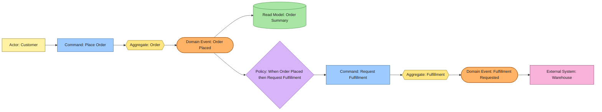

# Event Model Guide

## Contents

- [Purpose](#purpose)
- [EventStorming Notation](#eventstorming-notation)
- [Required Evidence](#required-evidence)
- [Modeling Rules](#modeling-rules)
- [Exclusions](#exclusions)
- [Document Template](#document-template)
- [Quality Checks](#quality-checks)
- [Universal Example](#universal-example)

## Purpose

An event model describes system behavior as causal timelines of actor intent, commands, consistency boundaries, domain events, policies, read models, and external systems. Derive it from business entity, actor, and single-scenario user-case specifications, preserving their language.

It is normative for command intent, aggregate responsibility, event meaning, policy reactions, and read-model dependencies. It is not broker topology or a serialized event contract.

## EventStorming Notation

| Element         | Meaning                                       | Naming                    | Conventional color |
| --------------- | --------------------------------------------- | ------------------------- | ------------------ |
| Domain Event    | Immutable business fact that occurred         | Past tense                | Orange             |
| Command         | Intent to decide or change something          | Imperative verb phrase    | Blue               |
| Actor           | Human or automated initiator                  | Business actor name       | Yellow             |
| Aggregate       | Consistency boundary deciding a command       | Business noun             | Yellow             |
| Policy          | Rule reacting to an event with a command      | “When … then …”           | Lilac              |
| Read Model      | Information for a decision or query           | Information-oriented noun | Green              |
| External System | Participant outside the modeled boundary      | System name               | Pink               |
| Hotspot         | Conflict, uncertainty, or unresolved decision | Question or risk          | Red                |

Include the element type in each diagram label so the model remains understandable without color. Arrange the principal timeline left to right:

```text
Actor -> Command -> Aggregate -> Domain Event
Domain Event -> Policy -> Command
Domain Event -> Read Model
```

## Required Evidence

Do not call the model complete until the following are known:

- capability scope, start, end, boundary, and source specifications;
- ubiquitous language and material prohibited synonyms;
- actors, their goals, and external systems;
- imperative commands, initiator, target aggregate, decision information, invariants, success events, and observable rejections;
- aggregates, consistency boundaries, necessary state, and produced events;
- past-tense domain events, producer, trigger, meaning, and essential business facts;
- policies with triggering event, resulting command, timing, idempotency, and owner;
- read models, source events, consumers, purpose, and accepted consistency delay;
- causal walkthroughs, hotspots, diagram, catalogs, and traceability.

Optional elements include process managers, time-triggered commands, compensation, bounded-context boundaries, meaning-level event versioning concerns, and confirmed assumptions.

## Modeling Rules

- Emit a domain event only after an accepted business fact or valid state transition.
- Give every command exactly one deciding aggregate or explicitly identified external decision maker.
- Connect separate aggregate transitions through events and policies; do not imply a hidden atomic mutation.
- Name both trigger and result for every policy.
- Keep aggregate invariants independent of eventually consistent read models.
- Record unclear rules, timing, ownership, or terminology as hotspots.
- Do not misrepresent rejection reasons as successful domain events.

## Exclusions

Exclude brokers, topics, subscriptions, partitions, consumer groups, transport envelopes, serialization schemas, handlers, packages, classes, database mutation events such as `RowInserted`, and vague technical events such as `ProcessCompleted`. Put delivery infrastructure in architecture or interface specifications.

## Document Template

```markdown
# Event Model: <Business Capability>

## Scope and Source Specifications

## Ubiquitous Language

## Legend

## Event-Storming Diagram

## Domain Event Catalog

## Command Catalog

## Aggregate and Consistency Boundaries

## Policy Catalog

## Read Models

## Actors and External Systems

## Causal Walkthroughs

## Hotspots and Decisions

## Traceability Matrix

## Confirmed Assumptions
```

Use a Mermaid left-to-right flowchart or fenced text diagram, a legend, catalogs, and prose walkthroughs. Diagram and catalogs must contain the same elements and causal connections.

## Quality Checks

- Events are immutable business facts in past tense.
- Commands express intent and have one deciding target.
- Aggregates own the invariants needed for their commands.
- Policies name trigger, result, timing, idempotency, and owner.
- Read models name source events and consumers.
- Language matches the source business specifications.
- Hotspots remain visible, and infrastructure is not confused with domain meaning.

## Universal Example



The customer issues Place Order. Order decides the command and produces Order Placed. That event updates Order Summary and triggers a policy that issues Request Fulfillment. Fulfillment prevents duplicate requests and produces Fulfillment Requested for the warehouse boundary.
