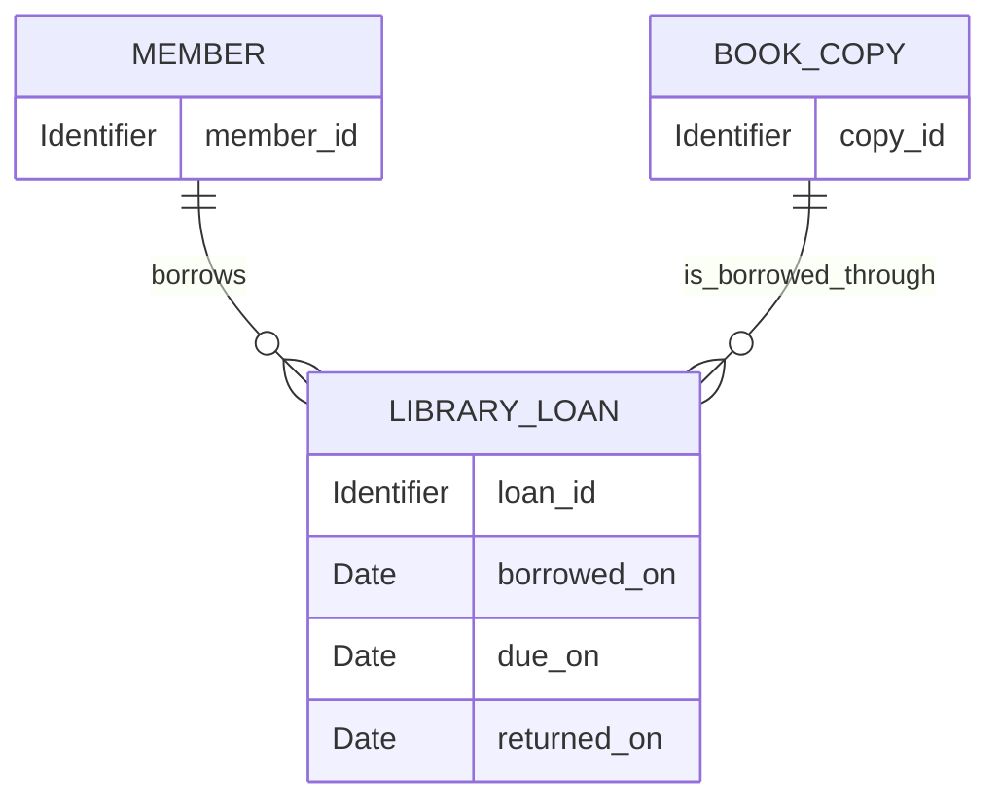

# Conceptual Database Model Specification

## Description

A conceptual database model specification describes how a business entity and its relationships are represented as persistent information. It translates business meaning into data objects, attributes, identifiers, relationships, and integrity constraints without selecting a database product or defining a physical schema.

The model MUST be derived from a corresponding business entity specification. The business specification remains authoritative for meaning and rules; the conceptual database model explains how those facts can be represented consistently as data.

The primary source is one named business entity specification. Related entity specifications may be referenced when relationships require them.

## Kind of Specification

This is a **conceptual system-data specification** and a **traceability bridge** between the business model and later logical or physical database design.

It is:

- normative for conceptual structure and integrity;
- solution-independent and database-neutral;
- based on business facts rather than current tables or application classes;
- suitable as input to logical schemas, migrations, repositories, data contracts, and persistence tests.

It is not SQL, a migration, an ORM model, or a vendor-specific database design.

## Source and Derivation Rules

- Identify the source business entity specification by project-relative path.
- Preserve its canonical terms and definitions.
- Map each stored or derived fact back to business information, identity, rule, or relationship.
- Do not invent business attributes or weaken business invariants.
- Surface gaps or contradictions in the business specification instead of resolving them silently in the data model.
- Distinguish persisted facts from derived values.
- Represent references to related business entities without redefining those entities unless their own specifications are also in scope.

## What the Specification Includes

### Required Sections

1. **Scope and source business specification**
   - Primary business entity being represented.
   - Source specification path and applicable version or status.
   - Persistence purpose and excluded data concerns.

2. **Conceptual data objects**
   - Named records or collections needed to represent the entity.
   - Business meaning and ownership of each object.
   - Source business concept for each object.

3. **Identifiers**
   - Stable identity of each data object.
   - Business identifiers and conceptual reference identifiers.
   - Uniqueness scope.

4. **Attributes**
   - Canonical name and business meaning.
   - Conceptual type such as Identifier, Text, Date, Timestamp, Boolean, Decimal, or Enumeration.
   - Required, optional, derived, or conditionally required status.
   - Source business information or rule.

5. **Relationships and cardinality**
   - Related data objects and business meaning of the connection.
   - Minimum and maximum cardinality.
   - Ownership, dependency, and optionality.

6. **Integrity constraints**
   - Identity, uniqueness, reference, temporal, and cross-attribute constraints.
   - Direct trace to the business invariant that requires each constraint.

7. **Derived information**
   - Values computed from persisted facts.
   - Source facts and calculation meaning, without prescribing an implementation algorithm.

8. **Conceptual relationship diagram**
   - A Markdown-native Mermaid ER diagram or a fenced text diagram.
   - A textual explanation when relationships are not obvious from the diagram.

9. **Traceability matrix**
   - Mapping from business entity elements to conceptual data elements and constraints.

10. **Representative data example**
    - One coherent example that exercises identity, relationships, and an important constraint.

### Optional Sections

- data ownership and authoritative source;
- confidentiality, retention, audit, and jurisdiction classifications;
- expected volume or growth characteristics relevant to later physical design;
- historical facts or audit history;
- confirmed assumptions and open questions.

## What the Specification Excludes

- SQL data types, DDL, migrations, indexes, partitions, and query plans;
- database vendor, storage engine, replication, and backup configuration;
- ORM annotations and programming-language types;
- API request or response schemas;
- denormalization chosen only for performance;
- UI-specific view state;
- new business rules unsupported by the source specification.

Conceptual object names may later become table names, but this specification does not claim that they are physical tables.

## Recommended Document Outline

```markdown
# Conceptual Database Model: <Business Entity>

## Scope and Source

## Conceptual Data Objects

## Identifiers

## Attribute Dictionary

## Relationships and Cardinality

## Integrity Constraints

## Derived Information

## Conceptual Diagram

## Traceability Matrix

## Representative Data Example

## Confirmed Assumptions and Open Questions
```

## Quality Criteria

A complete conceptual database model specification should satisfy the following checks:

- The primary business entity specification is identified and remains authoritative.
- Every data object, attribute, relationship, and constraint has a business source.
- Stable identity is distinct from mutable labels and display information.
- Cardinalities and optionality agree with the business relationships.
- Every invariant that affects persistence has a conceptual integrity constraint.
- Persisted and derived facts are clearly distinguished.
- The diagram, dictionaries, and traceability matrix describe the same model.
- No physical database decision is disguised as a business requirement.
- Unknowns are visible rather than silently invented.

## Example: Library Loan Conceptual Model

### Scope and Source

The model derives from the business entity specification **Library Loan**. It represents who borrowed a physical book copy, the borrowing period, and whether the copy has been returned.

### Conceptual Diagram



One Member may have many Library Loans over time. One Book Copy may also have many loans over time, but no more than one may lack a return date at a time. Each Library Loan references exactly one Member and one Book Copy.

### Conceptual Data Objects

| Data object         | Meaning                                               | Identity          |
| ------------------- | ----------------------------------------------------- | ----------------- |
| Library Loan        | One borrowing of one physical book copy by one member | Loan identifier   |
| Member reference    | Identity of the member responsible for the loan       | Member identifier |
| Book Copy reference | Identity of the physical copy being borrowed          | Copy identifier   |

### Attribute Dictionary

| Attribute         | Conceptual type | Requirement           | Business source           |
| ----------------- | --------------- | --------------------- | ------------------------- |
| Loan identifier   | Identifier      | Required and unique   | Library Loan identity     |
| Member identifier | Identifier      | Required              | Relationship to Member    |
| Copy identifier   | Identifier      | Required              | Relationship to Book Copy |
| Borrowed on       | Date            | Required              | Borrowing start           |
| Due on            | Date            | Required              | Required return date      |
| Returned on       | Date            | Required after return | Return fact               |

### Integrity Constraints

- A loan references exactly one existing Member and one existing Book Copy.
- `due_on` is later than `borrowed_on`.
- When present, `returned_on` is not earlier than `borrowed_on`.
- A Book Copy has at most one Library Loan without a `returned_on` value.

### Traceability Matrix

| Business element             | Conceptual representation                            |
| ---------------------------- | ---------------------------------------------------- |
| Stable Library Loan identity | Unique `loan_id`                                     |
| Exactly one Member           | Required Member reference                            |
| Exactly one Book Copy        | Required Book Copy reference                         |
| Due date after borrowed date | Temporal integrity constraint                        |
| One unreturned loan per copy | Conditional uniqueness where `returned_on` is absent |

### Representative Data Example

Loan `L-1042` references Member `M-18` and Book Copy `B-204`, with `borrowed_on` July 1, `due_on` July 15, and no `returned_on`. No other Library Loan without a return date may reference `B-204`.
