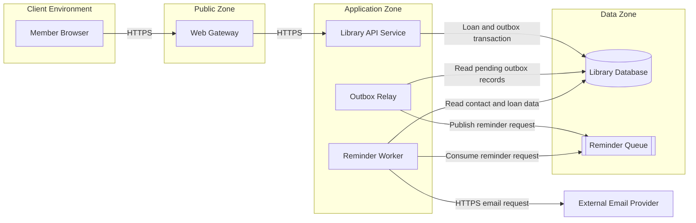

# Distributed Architecture Specification

## Description

A distributed architecture specification describes the system as collaborating components deployed across runtime environments and connected through explicit communication paths. It explains what each component is responsible for, where and how it runs, which state it owns, and how requests, data, and events move between components.

The specification combines three related views:

- **Component view**: the parts of the system and their responsibilities.
- **Deployment view**: runtime units, nodes, environments, replicas, and placement.
- **Connection view**: direction, protocol, security, and interaction style for every dependency.

## Kind of Specification

This is a **system architecture and deployment specification**. It is normative for system boundaries, deployment topology, ownership, and communication contracts, while remaining independent of incidental code organization.

It may name a technology or hosting product when that choice is a confirmed architectural constraint. Otherwise, prefer capability-level descriptions such as relational database, message broker, container, virtual machine, or managed service.

## Diagram Requirement

The Markdown specification MUST include at least one diagram in a Markdown-native form:

- a Mermaid diagram is preferred; or
- a fenced ASCII/text diagram is acceptable when Mermaid is unavailable or unsuitable.

The diagram MUST show system components, deployment grouping, and connections. A textual description and connection table MUST accompany the diagram so the architecture remains understandable when diagrams cannot be rendered.

## What the Specification Includes

### Required Sections

1. **Scope and architecture goals**
   - System or capability covered.
   - Business and quality goals driving distribution.
   - Explicitly excluded systems and environments.

2. **Actors and external systems**
   - Human or automated participants outside the system boundary.
   - External providers, consumers, and dependencies.

3. **System components**
   - Name, responsibility, exposed interfaces, consumed interfaces, and owned state.
   - Stateful or stateless classification.
   - Prohibited responsibilities when boundary clarity matters.

4. **Deployment model**
   - Deployment units and their runtime form.
   - Environment or node placement.
   - Replica count or scaling model when known.
   - Co-location and isolation constraints.

5. **Connections**
   - Source, destination, and direction.
   - Synchronous or asynchronous interaction.
   - Protocol or interface type.
   - Authentication, encryption, and network boundary.
   - Timeouts, retries, ordering, and delivery expectations when material.

6. **Data ownership and consistency**
   - Component that owns each data set.
   - Shared resources and rules that prevent competing writers.
   - Transactional boundaries and accepted consistency model.

7. **Primary runtime flows**
   - Textual walkthroughs of important request, query, and event paths.
   - Correlation across asynchronous steps where relevant.

8. **Availability and failure behavior**
   - Critical dependencies and failure domains.
   - Degraded behavior, retry boundaries, recovery, and single points of failure.

9. **Security and trust boundaries**
   - Public, private, privileged, and third-party zones.
   - Sensitive flows and least-privilege expectations.

10. **Observability and operations**
    - Health signals, logs, metrics, traces, audit information, and alert ownership.
    - Deployment, rollback, and configuration ownership at a conceptual level.

11. **Architecture diagram and connection matrix**
    - Diagram representing the same components and connections as the text.
    - Connection matrix for precise, accessible lookup.

12. **Decisions, assumptions, and open risks**
    - Confirmed constraints and material trade-offs.
    - Unresolved risks that affect topology or reliability.

### Optional Sections

- geographic regions and data residency;
- capacity and growth assumptions;
- disaster recovery targets;
- migration or transition architecture;
- cost constraints;
- alternative diagrams for separate environments or critical flows.

## What the Specification Excludes

- class, function, package, or source-directory structure;
- complete API or message schemas duplicated from interface specifications;
- database columns duplicated from data models;
- business rules duplicated from business specifications;
- low-level infrastructure-as-code and provider configuration;
- connections that have no named source, destination, or purpose.

## Recommended Document Outline

```markdown
# Distributed Architecture: <System or Capability>

## Scope and Architecture Goals

## Actors and External Systems

## Component Catalog

## Deployment Model

## Architecture Diagram

## Connection Matrix

## Data Ownership and Consistency

## Primary Runtime Flows

## Availability and Failure Behavior

## Security and Trust Boundaries

## Observability and Operations

## Decisions, Assumptions, and Open Risks
```

## Quality Criteria

A complete distributed architecture specification should satisfy the following checks:

- Every component has one coherent responsibility and an explicit state-ownership boundary.
- Every component in the text appears in the diagram, and every diagram element is described in the text.
- Deployment units are distinguished from logical components.
- Every connection has a direction, purpose, interaction style, and protocol.
- There are no unexplained shared databases or multiple writers to the same state.
- Synchronous and asynchronous dependencies are visibly different.
- Trust and network boundaries are explicit.
- Critical paths and failure behavior can be followed end to end.
- Scaling, availability, and recovery claims are measurable or clearly marked as assumptions.
- The model avoids vendor detail unless the vendor is an architectural constraint.

## Example: Public Library System

### Scope and Architecture Goals

The system allows Members to search for books, borrow available copies, view current loans, and receive due-date reminders. It separates interactive requests from reminder delivery so an unavailable email provider does not prevent borrowing.

### Architecture Diagram



### Component Catalog

| Component               | Responsibility                                             | State ownership                                   | Runtime character                           |
| ----------------------- | ---------------------------------------------------------- | ------------------------------------------------- | ------------------------------------------- |
| Web Gateway             | Terminate public HTTPS and route requests                  | No business state                                 | Stateless                                   |
| Library API Service     | Serve catalog and loan operations                          | Owns writes to catalog, loan, and new outbox data | Stateless process                           |
| Outbox Relay            | Reliably publish committed reminder requests               | Owns outbox dispatch status                       | Stateless relay with durable database state |
| Reminder Worker         | Deliver scheduled loan reminders                           | Owns reminder processing state                    | Stateless consumer with durable queue state |
| Library Database        | Store catalog, member, loan, and reminder-processing facts | Authoritative persistent state                    | Stateful                                    |
| Reminder Queue          | Buffer reminder requests until processed                   | Delivery and acknowledgement state                | Stateful                                    |
| External Email Provider | Deliver email outside the system boundary                  | External delivery state                           | External system                             |

### Deployment Model

| Deployment unit     | Placement                   | Scaling and availability                       |
| ------------------- | --------------------------- | ---------------------------------------------- |
| Member Browser      | Member device               | One independent client per session             |
| Web Gateway         | Public network edge         | At least two instances behind managed routing  |
| Library API Service | Private application network | Two or more interchangeable container replicas |
| Outbox Relay        | Private application network | One active relay or coordinated replicas       |
| Reminder Worker     | Private application network | One or more consumer replicas                  |
| Library Database    | Restricted data network     | Primary with recoverable standby               |
| Reminder Queue      | Restricted data network     | Durable managed cluster or equivalent          |
| Email Provider      | Third-party network         | Availability governed externally               |

### Connection Matrix

| Source              | Destination         | Style and protocol                     | Purpose                                               | Security and failure behavior                         |
| ------------------- | ------------------- | -------------------------------------- | ----------------------------------------------------- | ----------------------------------------------------- |
| Member Browser      | Web Gateway         | Synchronous HTTPS                      | Submit and view library requests                      | Public TLS; bounded request timeout                   |
| Web Gateway         | Library API Service | Synchronous HTTPS                      | Forward authenticated requests                        | Private authenticated connection                      |
| Library API Service | Library Database    | Synchronous database protocol over TLS | Commit the loan and reminder outbox record atomically | Private network; transaction bounded                  |
| Outbox Relay        | Library Database    | Synchronous database protocol over TLS | Read pending outbox records and record dispatch       | Restricted outbox access; retried after failure       |
| Outbox Relay        | Reminder Queue      | Asynchronous message publish           | Request later reminder delivery                       | Durable publish with idempotent retry                 |
| Reminder Worker     | Reminder Queue      | Asynchronous message consume           | Receive reminder work                                 | Acknowledge only after processing outcome is recorded |
| Reminder Worker     | Library Database    | Synchronous read over TLS              | Obtain due date and contact information               | Read-only authority for member and loan facts         |
| Reminder Worker     | Email Provider      | Synchronous HTTPS                      | Request email delivery                                | Timeout and retry outside the loan transaction        |

### Primary Runtime Flows

**Borrow a book**: the Browser sends an HTTPS request through the Web Gateway to the Library API Service. The service validates the borrowing and commits the new Library Loan and its reminder outbox record in one Library Database transaction. The Outbox Relay later publishes the committed reminder request to the durable queue and records successful dispatch.

**Send a reminder**: the Reminder Worker consumes a request, reads the current due date and contact information, calls the Email Provider, records the processing outcome, and acknowledges the message. Failure of the Email Provider leaves the borrowing path unaffected and permits later retry.

### Data Ownership and Consistency

- The Library API Service is the only component allowed to change Library Loans.
- The Library API Service creates reminder outbox records in the same transaction as the loan; the Outbox Relay changes only their dispatch status.
- The Reminder Worker may read loan and contact facts but cannot change a loan.
- Creating a loan, recording its authoritative business state, and recording the reminder request occur in one database transaction.
- Reminder delivery is eventually consistent with the committed loan and is retried independently.

### Security and Failure Summary

- Only the Web Gateway is reachable from the public network.
- The database and queue are reachable only from approved application components.
- Failure of the queue leaves the outbox record pending for later publication and does not corrupt a committed loan.
- Failure of the Email Provider delays notifications and does not make the Library API unavailable.
