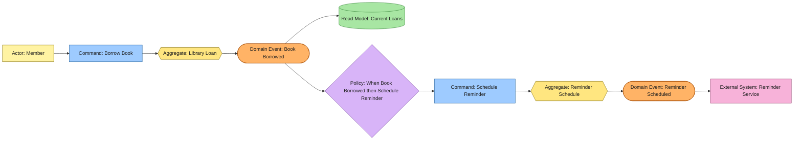

# Event Model Specification in Event-Storming Format

## Description

An event model specification describes system behavior as a timeline of actor intentions, commands, consistency boundaries, domain events, policies, read models, and external systems. It uses EventStorming notation to show why a business fact occurs and what reactions it causes.

The model is derived from business entity, actor, and user-scenario specifications. It preserves their language and makes causal relationships explicit without prescribing code structure or event transport.

## Kind of Specification

This is a **behavioral system and domain specification** in EventStorming format. It is normative for command intent, aggregate responsibility, event meaning, policy reactions, and read-model dependencies.

It is not an event-broker configuration or serialized event contract. Topics, queues, CloudEvents attributes, outbox tables, and delivery infrastructure belong to architecture or interface specifications unless they are unavoidable system constraints.

## Event-Storming Notation

Use the following elements consistently. Include the element type in its label so the model remains readable without color.

| Element         | Meaning                                           | Naming                    | Conventional color |
| --------------- | ------------------------------------------------- | ------------------------- | ------------------ |
| Domain Event    | Business fact that has occurred                   | Past tense                | Orange             |
| Command         | Intent to change or decide something              | Imperative verb phrase    | Blue               |
| Actor           | Human or automated initiator                      | Business actor name       | Yellow             |
| Aggregate       | Consistency boundary that decides a command       | Business noun             | Yellow             |
| Policy          | Rule that reacts to an event and issues a command | “When … then …”           | Lilac              |
| Read Model      | Information needed for a decision or query        | Information-oriented noun | Green              |
| External System | Participant outside the modeled boundary          | System name               | Pink               |
| Hotspot         | Conflict, uncertainty, or unresolved decision     | Question or risk          | Red                |

Arrange the principal timeline from left to right:

```text
Actor -> Command -> Aggregate -> Domain Event
Domain Event -> Policy -> Command
Domain Event -> Read Model
External System <-> Command, Event, or Read Model at the system boundary
```

A domain event is emitted only after a valid state transition or accepted business fact. Do not name technical callbacks, handler execution, database writes, or transport requests as domain events.

## What the Specification Includes

### Required Sections

1. **Scope and source specifications**
   - Business capability, process start and end, and system boundary.
   - Source entity, actor, and scenario specifications.

2. **Ubiquitous language**
   - Canonical terms used throughout the model.
   - Ambiguous or prohibited synonyms when material.

3. **Legend**
   - Element types, colors, shapes, and arrow semantics used by the diagram.

4. **Event-storming diagram**
   - Markdown-native Mermaid or fenced text diagram.
   - Left-to-right causal flow.
   - Labels that state element type as well as name.

5. **Domain event catalog**
   - Past-tense event name and business meaning.
   - Producing aggregate or external source.
   - Triggering command or prior fact.
   - Essential business facts carried by the event.

6. **Command catalog**
   - Imperative name and intent.
   - Initiating actor or policy.
   - Target aggregate.
   - Required decision information and invariants.
   - Success events and observable rejection reasons.

7. **Aggregate and consistency boundaries**
   - State and rules required to decide each command.
   - Events produced after valid transitions.
   - Explicit boundary between separate aggregates.

8. **Policy catalog**
   - “When event, then command” rule.
   - Required information, timing, idempotency, and ownership.
   - Separation between business policy and technical plumbing.

9. **Read models**
   - Information presented to actors or used to make decisions.
   - Source events and consumers.
   - Accepted consistency delay where relevant.

10. **Actors and external systems**
    - Initiating actors and their goals.
    - External systems that provide or consume facts.

11. **Causal walkthroughs**
    - Text description of each important flow from actor intent to resulting facts and policy reactions.

12. **Hotspots and decisions**
    - Unresolved terminology, ownership, sequencing, timing, or rule questions.
    - Resolution or accountable decision owner when known.

13. **Traceability matrix**
    - Links from scenario steps and business rules to commands, aggregates, events, policies, and read models.

### Optional Sections

- process managers or sagas for long-running stateful coordination;
- time-triggered commands;
- compensation facts and commands;
- bounded-context boundaries;
- event versioning concerns that affect meaning;
- confirmed assumptions.

## What the Specification Excludes

- broker, topic, subscription, partition, and consumer-group configuration;
- transport envelopes and serialization schemas;
- handler, package, or class names;
- database mutation events such as `RowInserted`;
- vague events such as `ProcessCompleted` without business meaning;
- policies that hide business decisions inside technical orchestration;
- read models used as the source of aggregate invariants.

## Recommended Document Outline

```markdown
# Event Model: <Business Capability>

## Scope and Source Specifications

## Ubiquitous Language

## Legend

## Event-Storming Diagram

## Domain Event Catalog

## Command Catalog

## Aggregate and Consistency Boundaries

## Policy Catalog

## Read Models

## Actors and External Systems

## Causal Walkthroughs

## Hotspots and Decisions

## Traceability Matrix

## Confirmed Assumptions
```

## Quality Criteria

A complete event model specification should satisfy the following checks:

- Every domain event is an immutable business fact named in past tense.
- Every command expresses intent and has exactly one deciding target.
- Every aggregate owns the invariants needed to decide its commands.
- Every policy names both its triggering event and resulting command.
- Every read model names its source events and consumers.
- Actor, command, event, and policy language matches the business specifications.
- The diagram and catalogs contain the same elements and causal connections.
- Separate aggregate transitions are connected through events and policies rather than hidden atomic mutation.
- Rejection reasons are not misrepresented as successful domain events.
- Hotspots are visible and do not silently become assumed behavior.
- Infrastructure mechanics are not confused with domain meaning.

## Example: Borrow an Available Book

### Scope and Sources

The model covers the successful borrowing of one available book copy and the scheduling of its due-date reminder. It derives from the Library Loan entity, Member actor, and Borrow an Available Book scenario.

### Legend and Event-Storming Diagram

The diagram uses labeled shapes and conventional EventStorming colors. Arrows mean “causes or supplies the next decision,” not a required network protocol.



### Domain Event Catalog

| Domain event       | Meaning                                                        | Producer                    | Essential facts                                      |
| ------------------ | -------------------------------------------------------------- | --------------------------- | ---------------------------------------------------- |
| Book Borrowed      | A Member became responsible for one Book Copy until a due date | Library Loan aggregate      | Loan ID, Member ID, Copy ID, borrowed date, due date |
| Reminder Scheduled | A reminder was scheduled for one Library Loan                  | Reminder Schedule aggregate | Reminder ID, Loan ID, planned notification date      |

### Command Catalog

| Command           | Initiator        | Target            | Decision and success event                                                                              |
| ----------------- | ---------------- | ----------------- | ------------------------------------------------------------------------------------------------------- |
| Borrow Book       | Member           | Library Loan      | Confirm active membership, available copy, and borrowing limit; emit Book Borrowed                      |
| Schedule Reminder | Borrowing policy | Reminder Schedule | Confirm no reminder already exists for the loan and calculate the planned date; emit Reminder Scheduled |

### Aggregate and Consistency Boundaries

**Library Loan** decides whether borrowing is valid using the Member's borrowing eligibility and the Book Copy's current availability. It creates one loan and produces Book Borrowed atomically within its consistency boundary.

**Reminder Schedule** owns reminder identity and duplicate-prevention rules. It is a separate boundary because scheduling may occur after the loan has committed and may be retried independently.

### Policy Catalog

| Policy                            | Trigger       | Resulting command | Timing and idempotency                                                                           |
| --------------------------------- | ------------- | ----------------- | ------------------------------------------------------------------------------------------------ |
| Schedule reminder after borrowing | Book Borrowed | Schedule Reminder | After the borrowing fact is durable; repeated handling uses Loan ID to avoid duplicate reminders |

### Read Models

| Read model    | Source events                        | Consumer | Purpose                                           |
| ------------- | ------------------------------------ | -------- | ------------------------------------------------- |
| Current Loans | Book Borrowed and later return facts | Member   | Show books currently borrowed and their due dates |

### Causal Walkthrough

1. The Member issues Borrow Book for one available copy.
2. The Library Loan aggregate verifies the borrowing rules and produces Book Borrowed.
3. Book Borrowed updates the Current Loans read model.
4. The borrowing policy reacts to Book Borrowed and issues Schedule Reminder.
5. The Reminder Schedule aggregate prevents duplicates and produces Reminder Scheduled.
6. The Reminder Service consumes the scheduling fact and later delivers the notice.

### Hotspots and Decisions

No unresolved hotspot is required for this example. A real model would record unclear ownership, timing, or business rules here rather than hiding them in the diagram.

### Traceability Matrix

| Business source                                | Event-model element                                   |
| ---------------------------------------------- | ----------------------------------------------------- |
| Member asks to borrow an available copy        | Borrow Book command                                   |
| Library Loan identity and borrowing invariants | Library Loan aggregate                                |
| Successful scenario result                     | Book Borrowed event                                   |
| Member views the new current loan              | Current Loans read model                              |
| Reminder follows successful borrowing          | Schedule-reminder policy and Reminder Scheduled event |
